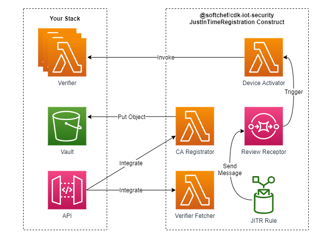
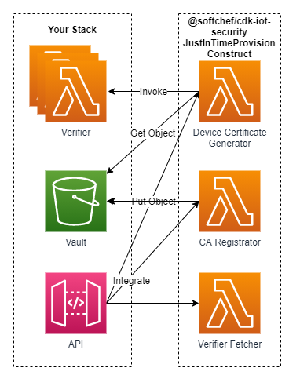

# CDK Construct - IoT Security

`cdk-iot-security` is a project surrounding the topic of the AWS IoT Device registration. In order to utilize the AWS IoT services securely, we might need to maintain our own certificate authorities, as known as CAs, and manage the CA-signed device certificates. AWS IoT holds an organized architecture for works mentioned previously, allows us to register multiple CA and certificates to it, and provides APIs for fetching information supporting our management. This project focuses on the autherization work flows of AWS IoT, plans to provide CDK constructs which satisfy the requirements of [Just-in-time registration](https://aws.amazon.com/tw/blogs/iot/just-in-time-registration-of-device-certificates-on-aws-iot/), and also the Construct for [Just-in-time provisioning](https://aws.amazon.com/tw/blogs/iot/setting-up-just-in-time-provisioning-with-aws-iot-core/).

## Installation

### NPM

    npm install @softchef/cdk-iot-security

### Yarn

    yarn add @softchef/cdk-iot-security
    

## Just-in-Time Registration




### Basic Usage

    import { JustInTimeRegistration } from '@softchef/cdk-iot-security';
    import * as cdk from '@aws-cdk/core';
    import * as s3 from '@aws-cdk/aws-s3';
    import * as lambda from '@aws-cdk/aws-lambda';

    const app = new cdk.App();
    const id = 'JitrDemo';
    const stack = new cdk.Stack(app, id);
    const anotherStack = new cdk.Stack(app, 'anotherStack');
    new JustInTimeRegistration(stack, id, {
        vault: {
            bucket: new s3.Bucket(anotherStack, 'myVault2'),
            prefix: 'my/ca/path',
        },
        verifiers: [
            new lambda.Function(anotherStack, 'verifier1', {
                code: lambda.Code.fromInline('exports.handler = async (_event) => { return JSON.stringify({ verified: true }); }'),
                handler: 'handler',
                runtime: lambda.Runtime.NODEJS_12_X,
            }),
            new lambda.Function(anotherStack, 'verifier2', {
                code: lambda.Code.fromInline('exports.handler = async (event) => { return JSON.stringify({ verified: event? true : false }); }'),
                handler: 'handler',
                runtime: lambda.Runtime.NODEJS_12_X,
            })
        ]
    });

## Just-in-Time Provision




### Example

JITP work flow is usually applied in a situation that the device is not able to generate their own certificate. This example simulate the situation with the following steps: the service provider deploy the JITP construct and provide the API; an user client get the generated device certificate through the API; the user client pass the device certificate to the device; the device connet to the AWS IoT through MQTT connection. Finally, the AWS IoT JITP service will be triggered and provision the expected resources.

First, deploy the JITP construct with demo file. Two AWS lambda functions, CA Registrator and Device Certificate Generator, will be deployed for further use.

    git clone https://github.com/SoftChef/cdk-iot-security.git
    cd cdk-iot-security
    npx projen build
    cdk deploy --app 'node lib/demo/jitp/deploy'

After deploying the construct, an URL returned from the console as the following format. In the following steps, we will use this URL to access the API.

    https://<prefix>.execute-api.<region>.amazonaws.com/prod/

Call the API with the following command. The API will invoke the CA Registrator and return an ID belongs to a CA certificate registered on AWS IoT. Save the CA ID for later use. In this POST request, you can also send your own provision template. You can design your own way to use the CA Registrator.

    curl -X POST https://<prefix>.execute-api.<region>.amazonaws.com/prod/caRegister

Call the API with the following command. The API will invoke the Device Certificate Registrator and return the keys and certificate signed by a specified CA. Notice that the device certificate is not registered on AWS IoT yet.

    curl -X POST -d '{caCertificateId:"<caCertificateId>"}' https://<prefix>.execute-api.<region>.amazonaws.com/prod/deviceCertificateGenerate > device-certificate.json

You can design your work flow that the user call this API to get a device certificate through a mobile App. Then, transfer the device certificate to the device for connecting to the AWS IoT.

The AWS IoT Root Certificate is neccessary for the connection. Run this command to download it.

    curl https://www.amazontrust.com/repository/AmazonRootCA1.pem > src/demo/jitp/root_ca.cert.pem

Remember to fill up the AWS IoT Endpoint in the file ```src/demo/jitp/device.js```. You can retrieve the endpoint ult with the following command.

    aws iot describe-endpoint --endpoint-type iot:Data-ATS

Finally, the device use the certificate to connect to the AWS IoT through MQTT connection. We simulate this process with the demostration file.

    node src/demo/jitp/device.js

A Certificate, Thing, and IoT Policy is set on the AWS IoT for the device.

## Roadmap

### JITP

* Directly return the generated device certificate and keys in a secure way.
